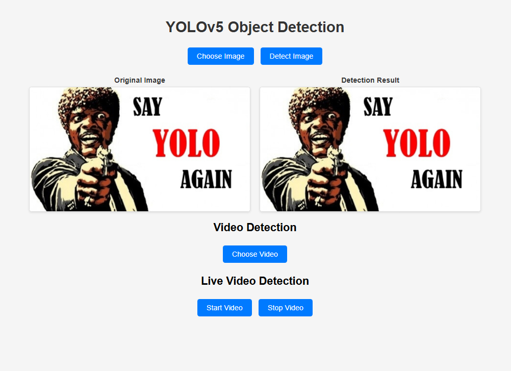

# YOLOv5-Flask
Use YOLOv5 and the Flask framework to implement a web-based deployment that allows users to upload images and videos online for detection, as well as perform real-time camera detection.
# Screenshot

